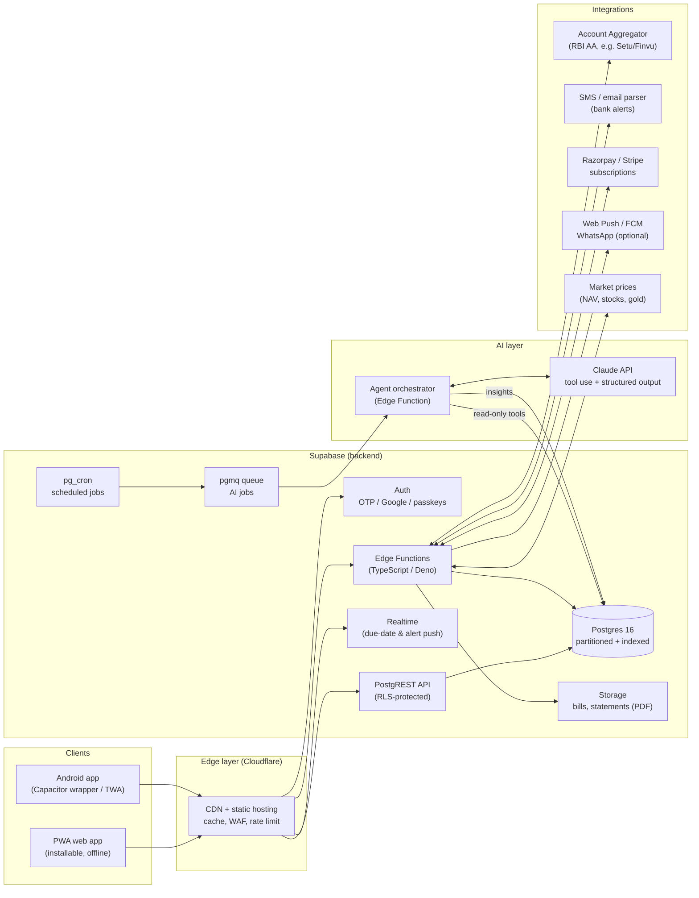
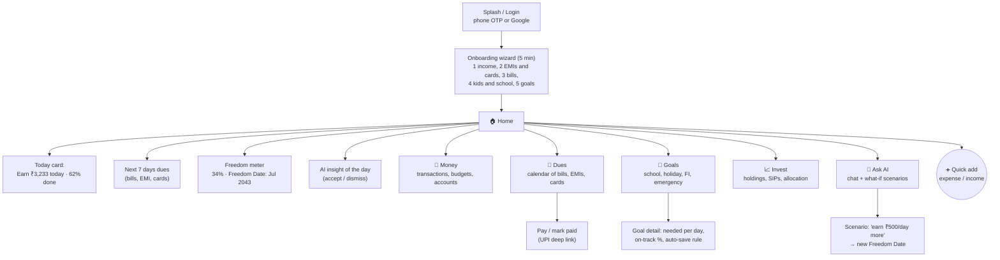

# WealthPilot: AI Personal Finance Assistant (Architecture and Design)

> Status: design proposal v1 (2026-10-09). Working name: **WealthPilot**, rename freely.
> Companion files: [`schema.sql`](./schema.sql) (database, indexes, security),
> [`EARNING-TARGET.md`](./EARNING-TARGET.md) (the "how much must I earn daily/weekly" engine).

---

## 1. Goal in one line

> **"Tell me how much I must earn every day and every week to cover everything (bills, EMIs,
> cards, kids' school, holidays, daily needs, investments) and to reach financial freedom.
> Then help me raise that number and cut what I don't need."**

Everything in the app serves that one number, the **Daily Earning Target (DET)**, and its
companion, the **Freedom Date** (the date your investments can pay for your life).

## 2. What the app does (modules)

| # | Module | What it tracks | AI help |
|---|--------|----------------|---------|
| 1 | **Cash flow** | Income (salary, business, rent, side income) and every expense | Auto-categorise transactions, spot anomalies |
| 2 | **Bills & due dates** | Electricity, rent, phone, insurance, subscriptions, school fees | Predict the amount, remind before the due date, flag price hikes |
| 3 | **Loans / EMI** | Home, car, personal and gold loans, with the full EMI schedule | Prepay-vs-invest advice, refinance alerts |
| 4 | **Credit cards** | Statement date, due date, total/min due, limit, utilisation | "Pay full" reminders, interest-trap warning, best-card-to-use |
| 5 | **Kids' education** | Per child: school fees, tuition, books, transport, future college | Inflation-adjusted college corpus plan |
| 6 | **Holidays & big events** | Planned trips, festivals, weddings, gadgets | Sinking fund: save a little each day instead of a shock |
| 7 | **Daily needs** | Groceries, fuel, milk, medicine | Budget per day, overspend nudges |
| 8 | **Investments** | MF/SIP, stocks, FD/RD, PPF/EPF/NPS, gold, real estate | Allocation drift, SIP step-up, goal mapping |
| 9 | **Financial freedom** | FI number, progress %, Freedom Date | Scenario forecasting ("what if I earn ₹500/day more?") |
| 10 | **Earning target** | Daily / weekly / monthly required income vs actual | Coach: how to raise it, what to cut |
| 11 | **Cost-cutter agent** | Unused subscriptions, duplicate charges, fees, high-interest debt | Weekly "you can save ₹X" report |
| 12 | **Family & subscription** | Household members, roles, plans, billing | n/a |

## 3. Architecture overview

Built on the stack this repo already uses (static PWA + Supabase + Edge Functions), so it is
cheap to run and you already know how to deploy it, while staying ready to scale.



### 3.1 Layers and responsibilities

| Layer | Tech | Why |
|-------|------|-----|
| UI | PWA (vanilla JS + Web Components, or SvelteKit if the app grows), Tailwind tokens, Chart.js/uPlot | Fast first paint on low-end phones; same approach as this repo |
| Mobile | Capacitor / TWA wrapper of the PWA | One codebase, Play Store presence |
| API | Supabase PostgREST + RPC functions | Zero server code for CRUD; security lives in the DB via RLS |
| Business logic | Postgres functions (math) + Edge Functions (integrations, AI) | The money math runs **in SQL**, close to the data, deterministic and testable |
| Jobs | `pg_cron` + `pgmq` | Nightly forecasts, reminders, statement parsing, AI runs; retries built in |
| AI | Claude API through an orchestrator Edge Function | Tool use + structured outputs, prompt caching, Batch API for nightly runs |
| Payments | Razorpay (India, UPI autopay) / Stripe (global) | Recurring subscriptions with webhooks |
| Observability | Supabase logs + `pg_stat_statements` + Sentry | Find slow queries and errors |

### 3.2 Golden rule: AI advises, SQL calculates

LLMs are great at explaining, categorising and finding patterns, but **numbers that decide
your money must be exact**. So:

- **Deterministic engine (SQL/TypeScript):** DET, EMI schedules, card interest, FI number,
  sinking-fund amounts, cash-flow projection. Unit-tested, reproducible.
- **AI agents (Claude):** read those numbers through *read-only tools*, then explain, rank,
  suggest and draft actions. The AI never writes money data directly; it creates
  `ai_insights` rows that the user accepts or dismisses.

## 4. AI agents

All agents run in the **orchestrator Edge Function** using Claude tool use. Each agent gets
a small, read-only tool set backed by SQL views scoped to one household.

| Agent | Trigger | Tools (read-only) | Output (structured JSON → `ai_insights`) |
|-------|---------|-------------------|-------------------------------------------|
| **Categoriser** | New transactions (queue, batched) | merchant history, category list | category, merchant, confidence, is_recurring |
| **Bill Sentinel** | Daily 7 AM | upcoming bills, card statements, EMI schedule, balances | "Pay card X ₹18,400 by 12 Oct; balance short by ₹3,200" |
| **Cost Cutter** | Weekly (Sunday) | 90-day spend by category/merchant, subscriptions, fees, interest paid | ranked savings list with ₹/month and the action to take |
| **Forecaster** | Nightly + on demand | cash-flow projection, goals, holdings, inflation assumptions | 12-month cash-flow risk, goal on-track %, Freedom Date explanation |
| **Earning Coach** | Weekly + when DET changes | DET breakdown, actual income trend | "You need ₹3,233/day; you made ₹2,790/day this week; here are 3 levers" |
| **Investment Advisor** | Monthly / on price swings | holdings, allocation targets, goals | drift alerts, SIP step-up suggestion (education only, not a licensed advisor) |
| **Chat Assistant** | User asks | all of the above + scenario tool | natural answers: "Can I afford a ₹1.2L Goa trip in May?" |

### 4.1 Model and API choices

- **Model:** `claude-opus-5-5` for all agents by default. If cost matters later, the
  high-volume Categoriser is the first candidate to move to a cheaper model (measure first).
- **Structured outputs** (`output_config.format` with a JSON schema) for every agent, so
  insights are always valid JSON that the app can render and store.
- **Tool use** with `strict: true` tools; tools are SQL views/RPCs that take
  `household_id` from the authenticated job context, **never from the model**.
- **Prompt caching:** the stable system prompt + tool definitions + category list come first
  and are cached; the household's data comes after. This makes repeated runs cheap.
- **Batch API** for nightly/weekly agents across all households: about 50% cheaper and no
  latency pressure.
- **Effort:** `low` for categorisation and chat small-talk, `medium`/`high` for forecasting
  and cost-cutting reports.
- **Refusal handling:** check `stop_reason` before reading content; enable the server-side
  fallback option.

### 4.2 Privacy for AI

- Send **aggregates and masked data** (last 4 digits only, no full account numbers, no PAN/Aadhaar).
- Per-user AI consent toggle; AI usage metered per plan (`ai_usage` table).
- Every agent run logged in `ai_agent_runs` (tokens, cost, duration, status) for audit and billing.

## 5. Users, roles and subscription model

### 5.1 Tenancy

Multi-tenant by **household** (a family workspace). One login can belong to several
households (e.g. your own family + your parents'). Every money row carries `household_id`
and Row Level Security allows access only to members.

### 5.2 Roles

| Scope | Role | Can do |
|-------|------|--------|
| Platform | `super_admin` | Everything, plans, pricing, support tools (you) |
| Platform | `support` | Read-only view of account status, never financial data unless the user grants access |
| Household | `owner` | Full control, billing, invite/remove members |
| Household | `partner` | Full read/write on finances, no billing |
| Household | `member` | Add own expenses, see shared budgets (e.g. teenage kids) |
| Household | `viewer` | Read-only (e.g. a parent) |
| Household | `advisor` | Time-boxed, read-only access for a CA / financial planner |

### 5.3 Plans (example pricing, India)

| Plan | Price | Limits |
|------|-------|--------|
| **Free** | ₹0 | 1 household, 2 members, manual entry, 3 goals, 20 AI messages/month |
| **Plus** | ₹149/month | Bank/SMS import, unlimited bills/EMI/cards, weekly Cost Cutter, 300 AI msgs |
| **Family** | ₹299/month | 6 members, kids' education planner, all agents, 1,000 AI msgs |
| **Pro / Advisor** | ₹999/month | Manage up to 25 client households, reports export, white-label |

Plans are rows in `plans` with a `features` JSON, so you change limits without code.
Feature checks go through one SQL function `has_feature(household_id, 'feature_key')`.

## 6. Screen flow (modern, clean UX)

Design principles: **one number first** (DET), **cards not tables**, **thumb-reachable
bottom nav**, **dark mode**, **max 3 taps to add an expense**, **every screen answers
"so what?"** with one action button.



### 6.1 Home screen layout (mobile)

```
┌──────────────────────────────────┐
│  Good morning, Priya        🔔 3 │
├──────────────────────────────────┤
│  TODAY'S EARNING TARGET          │
│  ₹3,233 / day    ₹22,631 / week  │
│  ███████████░░░░░  62% this week │
│  ▲ ₹120 vs last month  [Why?]    │
├──────────────────────────────────┤
│  DUE IN NEXT 7 DAYS      ₹42,300 │
│  • HDFC card     ₹18,400  Oct 12 │
│  • Home EMI      ₹21,500  Oct 15 │
│  • School bus    ₹ 2,400  Oct 15 │
├──────────────────────────────────┤
│  FREEDOM  ●●●●○○○○○○  34%        │
│  Freedom Date: Jul 2043          │
├──────────────────────────────────┤
│  🤖 You pay ₹1,947/mo for 4 apps │
│  you didn't open in 60 days.     │
│  [Review]           [Dismiss]    │
├──────────────────────────────────┤
│  🏠   💸   📅   🎯   🤖          │
└──────────────────────────────────┘
```

Visual system: neutral background, one brand accent colour, green = on track, amber = due
soon, red = overdue/short. Large numerals (tabular figures), 16px min body text, skeleton
loaders instead of spinners.

## 7. Performance design

Target: **p95 < 200 ms** for any screen's API calls, **< 1.5 s** first contentful paint on a
mid-range Android over 4G, **Home in one round trip**.

### 7.1 Database

| Technique | Where | Effect |
|-----------|-------|--------|
| **Composite indexes led by `household_id`** | every tenant table | RLS filter + query filter use the same index |
| **Range partitioning by month** | `transactions`, `ai_agent_runs`, `notifications`, `audit_log` | Queries touch only recent partitions; old ones archived/dropped cheaply |
| **Partial indexes** | unpaid bills, active loans, open statements, unread notifications | Tiny indexes for the hottest "what's due" queries |
| **Covering indexes (`INCLUDE`)** | transaction list, dues list | Index-only scans, no heap lookups |
| **BRIN indexes** | append-only time columns on logs | ~1000× smaller than B-tree for time ranges |
| **Trigram GIN** | merchant / description search | Fast fuzzy search ("swigy" finds Swiggy) |
| **Pre-aggregated tables** | `daily_household_summary`, `monthly_category_spend` | Dashboards read 30 rows, not 3,000 transactions |
| **Materialized view** | `mv_earning_target` refreshed `CONCURRENTLY` | DET loads instantly |
| **One RPC per screen** | `get_home(household_id)` returns all Home cards as JSON | Single round trip |
| **Keyset pagination** | transaction lists (`WHERE (txn_date, id) < (...)`) | Constant speed at any page depth (no `OFFSET`) |
| **RLS with `(select auth.uid())`** and a `security definer` membership check | all policies | Postgres evaluates auth once per query, not per row |
| **Money as `bigint` paise** | all amounts | Exact maths, faster than `numeric`, no float errors |
| **Connection pooling** | Supavisor in transaction mode for Edge Functions | Avoids connection storms |
| **Autovacuum tuning** | hot tables (`transactions`, `bill_occurrences`) | Keeps index-only scans effective |

### 7.2 Monitoring and tuning loop

1. `pg_stat_statements` top-20 by total time, reviewed weekly.
2. `EXPLAIN (ANALYZE, BUFFERS)` for every new RPC before release; CI fails if a query on
   seeded data (100k transactions) does a sequential scan of a tenant table.
3. `auto_explain` logs queries > 250 ms in staging.
4. Index-usage report (`pg_stat_user_indexes.idx_scan = 0`) monthly; drop unused indexes.

### 7.3 Frontend

- Service worker: app shell cached, **stale-while-revalidate** for dashboards, offline
  quick-add queue (syncs when online).
- Code-split per tab; Home bundle < 80 KB gz.
- Realtime only for dues/alerts channel; everything else on demand.
- Charts render from pre-aggregated rows (≤ 400 points).

### 7.4 Jobs and AI

- All heavy work async through `pgmq`; UI never waits for AI.
- AI results cached in `ai_insights` with `valid_until`; re-run only if inputs changed
  (input hash).
- Nightly agents via Batch API; chat via streaming.

## 8. Security and compliance

- **Auth:** Supabase Auth (phone OTP, Google, passkeys); optional app PIN/biometric lock.
- **RLS on every table**; service role used only inside Edge Functions.
- **Encryption:** TLS everywhere; sensitive columns (account numbers, notes) encrypted with
  `pgsodium`/Vault; only last 4 digits stored in clear.
- **Never store card CVV or full card numbers.** No PAN/Aadhaar unless needed for AA consent.
- **Audit log** of every write on money tables (trigger → `audit_log`).
- **India DPDP Act 2023:** consent records, data export, account deletion (already pattern in
  this repo: `delete-account.html`).
- Bank data via **RBI Account Aggregator** consent flow; never ask for net-banking passwords.
- Disclaimer: AI suggestions are educational, not SEBI-registered investment advice.

## 9. Delivery roadmap

| Phase | Weeks | Scope |
|-------|-------|-------|
| **0. Foundation** | 1–2 | Repo, Supabase project, schema + RLS, auth, CI with query-plan checks |
| **1. MVP (personal use)** | 3–6 | Manual income/expense, bills, EMIs, cards, dues calendar, **DET engine**, Home screen, reminders |
| **2. Goals & kids** | 7–9 | Goals, sinking funds, education planner, holiday planner, Freedom Date |
| **3. AI agents** | 10–13 | Categoriser, Bill Sentinel, Cost Cutter, Earning Coach, Ask AI chat |
| **4. Automation** | 14–17 | SMS/email parsing, statement PDF import, Account Aggregator, investments + prices |
| **5. SaaS** | 18–22 | Households/roles, plans, Razorpay subscriptions, admin console, advisor mode |
| **6. Scale & polish** | ongoing | Load tests, partition archiving, Play Store release, WhatsApp alerts |

## 10. Recommended repository layout (separate repo)

This design lives in `m-chococravings/docs` for now. The app itself should get its **own
repository** so it doesn't mix with the bakery code:

```
wealthpilot/
├─ apps/web/            # PWA (screens, components, service worker)
├─ apps/android/        # Capacitor wrapper
├─ supabase/
│  ├─ migrations/       # schema.sql split into ordered migrations
│  ├─ functions/
│  │  ├─ agent-orchestrator/   # Claude agents
│  │  ├─ ingest-sms/           # bank alert parser
│  │  ├─ billing-webhook/      # Razorpay/Stripe
│  │  └─ send-push/
│  └─ seed/             # 100k-transaction perf seed
├─ packages/finance-core/ # DET, EMI, FI maths (TS, mirrored in SQL, shared tests)
└─ tests/               # unit, RLS, query-plan tests
```
